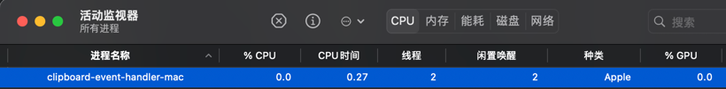

# Node Clipboard Event (Apple Silicon M1 Version)

[](https://opensource.org/licenses/MIT)

This repository provides an ARM64 (Apple Silicon M1) version of the Node Clipboard Event library, which allows you to interact with the clipboard events on macOS using Node.js.

**Note**: The original repository and source code for the Node Clipboard Event library can be found [here](https://github.com/sudhakar3697/node-clipboard-event).

## Overview

The Node Clipboard Event library provides a way to monitor clipboard events and perform actions when clipboard contents change. This version has been compiled specifically for Apple Silicon M1 devices.



## Usage

Download the executable file `clipboard-event-handler-mac` :

```bash
   wget https://raw.githubusercontent.com/wangyw6716/clipboard-event-handler-mac-apple-silicon-arm64-M1/main/clipboard-event-handler-mac

   # or curl
   curl -O -L https://raw.githubusercontent.com/wangyw6716/clipboard-event-handler-mac-apple-silicon-arm64-M1/main/clipboard-event-handler-mac

```
